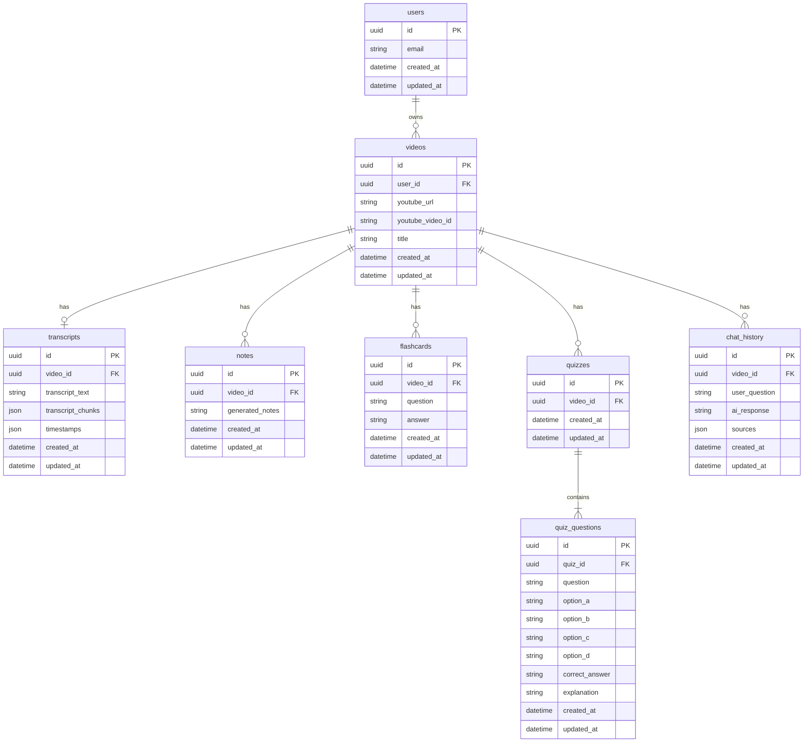
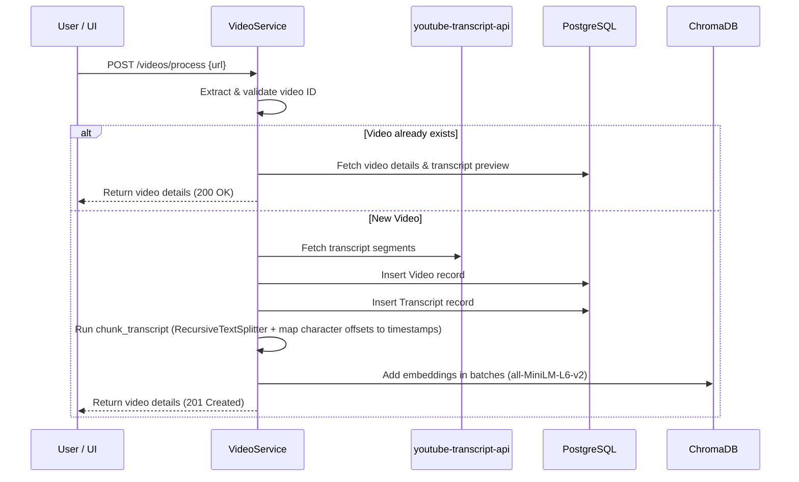

# 🤝 Project Handoff: YouTube Learning Companion

Welcome to the **YouTube Learning Companion** handoff document. This file provides an end-to-end technical overview of the application, including the system architecture, database schema, RAG & LLM pipelines, frontend components, and instructions for setup and future development.

---

## 🏗️ System Architecture Overview

The system follows a classic decoupled client-server architecture with a relational database for metadata/transcripts and a vector store for RAG operations.

```
┌─────────────────────────────────────────────────────────┐
│                   Frontend (React + TS)                   │
│              Vanilla CSS · Vite · Axios                  │
└─────────────────────┬───────────────────────────────────┘
                      │ HTTP (REST API)
┌─────────────────────▼───────────────────────────────────┐
│                  Backend (FastAPI)                        │
│  ┌──────────┐  ┌──────────┐  ┌──────────┐               │
│  │ Routers  │→ │ Services │→ │  Repos   │→ PostgreSQL   │
│  └──────────┘  └────┬─────┘  └──────────┘               │
│                     │                                     │
│               ┌─────▼─────┐                              │
│               │    RAG    │→ ChromaDB (vector store)     │
│               │ Pipeline  │→ Sentence Transformers        │
│               │  (Local)  │  (all-MiniLM-L6-v2)           │
│               └─────┬─────┘                              │
│                     │                                     │
│               ┌─────▼─────┐                              │
│               │   Groq    │ (or Gemini / OpenAI)          │
│               │    LLM    │                               │
│               └───────────┘                              │
└─────────────────────────────────────────────────────────┘
```

---

## 📂 Codebase Directory Structure

### 🐍 Backend (`/backend`)
The backend is built with **FastAPI 0.136+** using Python 3.12, organized into a clean repository/service pattern.

*   [main.py](file:///c:/Users/shashi/Desktop/Utube/backend/app/main.py) — Application configuration, custom exception handlers (e.g. `VideoNotFoundError`, `TranscriptNotFoundError`), CORS settings, and startup/shutdown lifespan context.
*   `api/` — Route handlers for each resource prefix.
    *   [router.py](file:///c:/Users/shashi/Desktop/Utube/backend/app/api/router.py) — Root router mapping all resources under `/api/v1`.
    *   [videos.py](file:///c:/Users/shashi/Desktop/Utube/backend/app/api/videos.py) — YouTube video registration and metadata extraction.
    *   [notes.py](file:///c:/Users/shashi/Desktop/Utube/backend/app/api/notes.py) — Summarization and Markdown study notes endpoints.
    *   [flashcards.py](file:///c:/Users/shashi/Desktop/Utube/backend/app/api/flashcards.py) — Study flashcard retrieval and trigger generation.
    *   [quizzes.py](file:///c:/Users/shashi/Desktop/Utube/backend/app/api/quizzes.py) — Multiple Choice Questions retrieval & force re-generation endpoints.
    *   [chat.py](file:///c:/Users/shashi/Desktop/Utube/backend/app/api/chat.py) — Q&A RAG chat interface and history tracker.
*   `core/` — Core configuration, dependencies, logging, and error handling.
    *   [config.py](file:///c:/Users/shashi/Desktop/Utube/backend/app/core/config.py) — Pydantic Settings matching environment variables.
    *   [dependencies.py](file:///c:/Users/shashi/Desktop/Utube/backend/app/core/dependencies.py) — DB session management dependencies (`get_db`).
    *   [exceptions.py](file:///c:/Users/shashi/Desktop/Utube/backend/app/core/exceptions.py) — Custom domain-specific exception definitions.
*   `db/` — Database setup.
    *   [base.py](file:///c:/Users/shashi/Desktop/Utube/backend/app/db/base.py) — Declarative SQL Base and `TimestampMixin` for automatic created/updated tracking.
    *   [database.py](file:///c:/Users/shashi/Desktop/Utube/backend/app/db/database.py) — SQLAlchemy async engine and session factory initialization.
*   `models/` — SQLAlchemy ORM Models.
    *   [user.py](file:///c:/Users/shashi/Desktop/Utube/backend/app/models/user.py) — Users table mapping.
    *   [video.py](file:///c:/Users/shashi/Desktop/Utube/backend/app/models/video.py) — Videos table mapping with 1-to-many relationships to other resources.
    *   [transcript.py](file:///c:/Users/shashi/Desktop/Utube/backend/app/models/transcript.py) — YouTube transcript text and JSON timestamps mapping.
    *   [note.py](file:///c:/Users/shashi/Desktop/Utube/backend/app/models/note.py) — Study notes table.
    *   [flashcard.py](file:///c:/Users/shashi/Desktop/Utube/backend/app/models/flashcard.py) — 20 study questions/answers pairs.
    *   [quiz.py](file:///c:/Users/shashi/Desktop/Utube/backend/app/models/quiz.py) and [quiz_question.py](file:///c:/Users/shashi/Desktop/Utube/backend/app/models/quiz_question.py) — 10 academic-level MCQs.
    *   [chat_history.py](file:///c:/Users/shashi/Desktop/Utube/backend/app/models/chat_history.py) — Grounded user Q&A interactions history.
*   `repositories/` — Data Access Layer executing optimized async raw queries.
    *   `video_repo.py`, `transcript_repo.py`, `note_repo.py`, `flashcard_repo.py`, `quiz_repo.py`, `chat_repo.py`.
*   `services/` — Business logic wrappers communicating with Langchain and external APIs.
    *   [llm_service.py](file:///c:/Users/shashi/Desktop/Utube/backend/app/services/llm_service.py) — Core wrapper abstracting Groq, Gemini, and OpenAI LLM generation through LangChain.
    *   [video_service.py](file:///c:/Users/shashi/Desktop/Utube/backend/app/services/video_service.py) — Orchestrator for fetching transcripts, adding DB records, and vectorizing.
    *   [note_service.py](file:///c:/Users/shashi/Desktop/Utube/backend/app/services/note_service.py) — Markdown summary generation.
    *   [flashcard_service.py](file:///c:/Users/shashi/Desktop/Utube/backend/app/services/flashcard_service.py) — Concept extractors creating flashcard arrays.
    *   [quiz_service.py](file:///c:/Users/shashi/Desktop/Utube/backend/app/services/quiz_service.py) — MCQ creator incorporating prefix-stripping and validation logic.
    *   [chat_service.py](file:///c:/Users/shashi/Desktop/Utube/backend/app/services/chat_service.py) — Chat Q&A and history management.
*   `rag/` — Vector embedding generation and similarity retrieval pipelines.
    *   [chunker.py](file:///c:/Users/shashi/Desktop/Utube/backend/app/rag/chunker.py) — Maps characters in text chunks back to original video timestamp ranges.
    *   [embeddings.py](file:///c:/Users/shashi/Desktop/Utube/backend/app/rag/embeddings.py) — Instantiates the `HuggingFaceEmbeddings` model (`all-MiniLM-L6-v2`).
    *   [vector_store.py](file:///c:/Users/shashi/Desktop/Utube/backend/app/rag/vector_store.py) — Isolated ChromaDB collections manager keyed per video UUID.
    *   [pipeline.py](file:///c:/Users/shashi/Desktop/Utube/backend/app/rag/pipeline.py) — Joins retrieved context documents and feeds formatted prompts into the LLM.
*   `utils/` — Utility modules.
    *   [youtube.py](file:///c:/Users/shashi/Desktop/Utube/backend/app/utils/youtube.py) — Regex validators and extractors for standard, short, mobile, embed, and Shorts YouTube URLs.

---

### ⚛️ Frontend (`/frontend`)
The frontend is built with **React 19 + Vite + TypeScript** with customized dark-mode vanilla CSS styles.

*   [App.tsx](file:///c:/Users/shashi/Desktop/Utube/frontend/src/App.tsx) — Main layout container rendering background float orbs and routing paths.
*   `pages/` — Page components.
    *   [HomePage.tsx](file:///c:/Users/shashi/Desktop/Utube/frontend/src/pages/HomePage.tsx) — Hero component displaying the main video input form and a dashboard of processed videos.
    *   [VideoPage.tsx](file:///c:/Users/shashi/Desktop/Utube/frontend/src/pages/VideoPage.tsx) — Master workspace syncing the embedded YouTube player, tab contents, and history sidebar.
*   `components/` — UI Components.
    *   `VideoPlayer.tsx` — Custom wrapper syncing with the YouTube IFrame API to dynamically adjust play times when timestamps are clicked.
    *   `TranscriptView.tsx` — Shows complete transcripts grouped by clickable timestamp links.
    *   `NotesView.tsx` — Displays structured markdown study notes.
    *   `FlashcardView.tsx` — Card layouts showing questions and answers.
    *   `QuizView.tsx` — MCQ workflow showing grading, correct choices, and explanatory notes.
    *   `ChatPanel.tsx` — RAG-grounded chatbot list showing sources with clickable jump-to timestamps.
    *   `Sidebar.tsx` — Navigable list of previously indexed videos.
    *   `VideoInput.tsx` — Standardized link validator.
*   [client.ts](file:///c:/Users/shashi/Desktop/Utube/frontend/src/api/client.ts) — Axios client interfacing with the backend REST endpoints.
*   [index.ts](file:///c:/Users/shashi/Desktop/Utube/frontend/src/types/index.ts) — Unified TypeScript interface definitions.

---

## 💾 Relational Database Schema



---

## 🚀 Key Workflows & Data Pipelines

### 1. Video Processing & Indexing Pipeline
When a user submits a YouTube URL:


### 2. Retrieval-Augmented Generation (RAG) Chat Pipeline
When a user asks a question about a video:
1.  **Retrieve:** The question is sent to `ChatService` which calls `RAGPipeline.answer_question`.
2.  **Vector Search:** ChromaDB runs a similarity search for the closest chunks within the video-specific collection (`video_<sanitized_uuid>`) using `all-MiniLM-L6-v2`.
3.  **Format Context:** Retracted text chunks are reconstructed into a context paragraph prefixing each segment with its respective timestamp (e.g. `[MM:SS] Text content...`).
4.  **LLM Call:** A structured prompt is sent to the configured LLM provider (Groq/Gemini/OpenAI) instructing it to answer strictly based on the provided context.
5.  **Output & Sources:** The generated answer is saved to `chat_history` database tables along with its sources, and then streamed/returned back to the user interface.

### 3. Study Materials Generation (Notes, Flashcards, Quizzes)
All study materials are generated lazily on-demand when the user switches to their respective workspace tabs:
*   **Notes:** Generates detailed Markdown pages containing topics (`##`), subtopics (`###`), and bullet summaries.
*   **Flashcards:** Requests exactly 20 question-answer pairs returned in structured JSON lists, storing them individually.
*   **Quiz:** Generates 10 multiple-choice questions with plausible distractors, grading explanations, and verifies JSON boundaries. It also sanitizes LLM prompt leakage (strips prefixes like *"Based on the transcript..."*).

---

## ⚡ Development & Setup Commands

### Backend Setup
1.  Ensure you have a local PostgreSQL instance running and create a database named `youtube_companion`.
2.  Navigate to `/backend` and create a virtual environment:
    ```bash
    python -m venv venv
    venv\Scripts\activate
    pip install -r requirements.txt
    ```
3.  Copy `.env.example` to `.env` and fill in your keys:
    ```env
    DATABASE_URL=postgresql+asyncpg://postgres:<password>@localhost:5432/youtube_companion
    LLM_PROVIDER=groq
    GROQ_API_KEY=your_key
    ```
4.  Run migrations and start the server:
    ```bash
    alembic upgrade head
    uvicorn app.main:app --reload --port 8000
    ```
5.  **Run backend tests:**
    ```bash
    pytest tests/ -v
    ```

### Frontend Setup
1.  Navigate to `/frontend` and install packages:
    ```bash
    npm install
    npm run dev
    ```
2.  The Vite server runs at `http://localhost:5173`. Proxies configured in `vite.config.ts` will route `/api/v1` traffic to the FastAPI server at `http://localhost:8000`.

---

## 💡 Future Enhancements & TODOs

1.  **Video Title / Metadata Scraping:** Currently, video titles default to `None` or "Untitled Video" on registration. Adding a helper utilizing `yt-dlp` or standard YouTube API scrapes to fetch the true title, channel, and thumbnail duration would improve visual polish.
2.  **Real Authentication:** Currently, the system injects a hardcoded placeholder UUID `00000000-0000-0000-0000-000000000001` for the current user. Integrate OAuth2 or JWT-based authentication handlers.
3.  **Quiz scoring history:** Let users track their past scores, incorrect answers, and learning progress over time.
4.  **Export Options:** Allow exporting study notes as PDF, Markdown files, or directly syncing flashcards to Anki.
